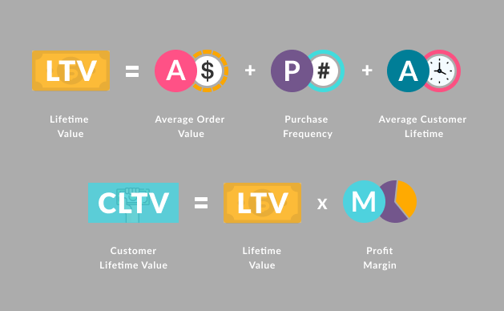

# FLO: CLTV Prediction with BG-NBD and Gamma-Gamma

FLO wants to set a roadmap for sales and marketing activities.
In order for the company to make a medium-long-term plan, existing customers
potential value must be estimated.
The dataset will store its last purchases from Flo on OmniChannel (both online) in 2020 - 2021.
from the information obtained from the past shopping behaviors of customers who are both offline shopper and
consists of.

---

### Features
- Total Features : 12
- Total Row : 19.945
- CSV File Size : 2.7 MB

* **master_id:** Unique customer number
* **order_channel:** Which channel of the shopping platform is used (Android, ios, Desktop, Mobile)
* **last_order_channel:** The channel where the last purchase was made
* **first_order_date:** Date of the customer's first purchase
* **last_order_date:** The date of the customer's last purchase
* **last_order_date_online:** The date of the last purchase made by the customer on the online platform
* **last_order_date_offline:** The date of the last purchase made by the customer on the offline platform
* **order_num_total_ever_online:** The total number of purchases made by the customer on the online platform
* **order_num_total_ever_offline:** Total number of purchases made by the customer offline
* **customer_value_total_ever_offline:** The total price paid by the customer for offline purchases
* **customer_value_total_ever_online:** The total price paid by the customer for their online shopping
* **interested_in_categories_12:** List of categories the customer has purchased from in the last 12 months